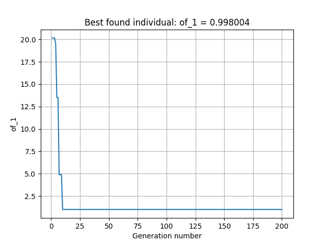
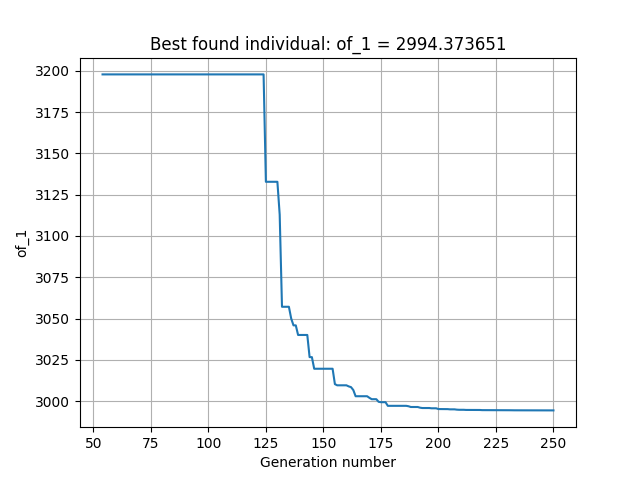
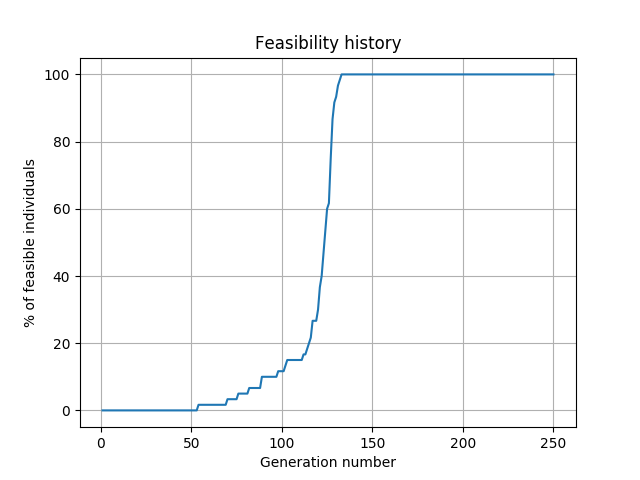
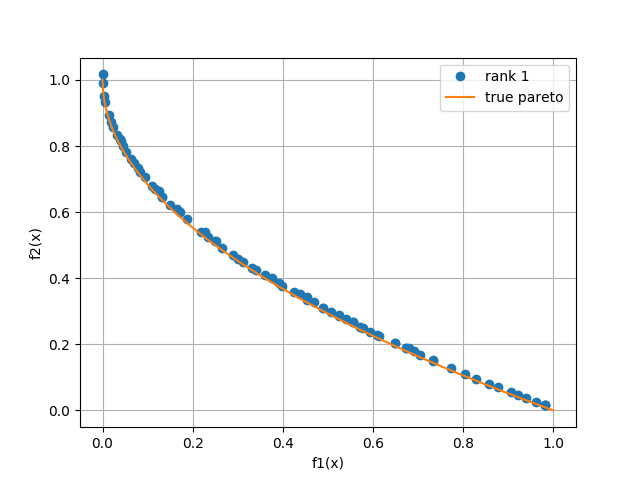
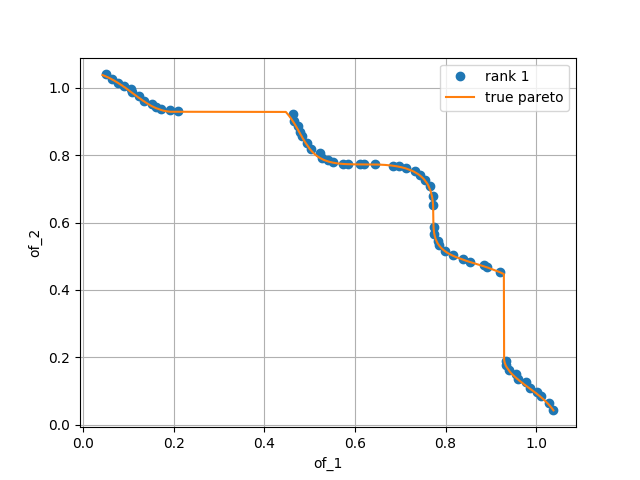
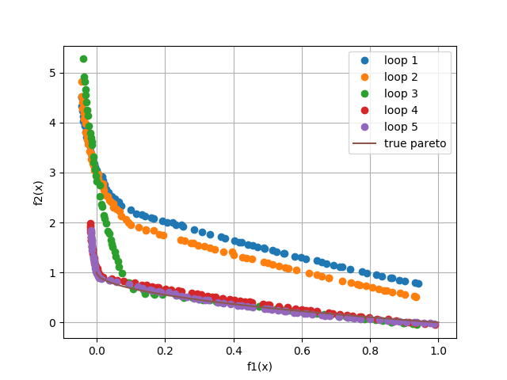

# HAMON
HAMON is an optimization platform based on Evolutionary Algorithms (EA) written in Python. It can deal with single- and
multi-objective as well as constrained and unconstrained problems. It currently has implemented Genetic Algorithms (GA)
and Differential Evolution (DE) as the core of the optimization as well as meta-modeling based on Radial Basis Functions
(RBF) to help accelerate the process when each design evaluation is computationally expensive.

## Methodology used
As previously mentioned HAMON can use GAs and DE together with RBF to solve optimization problems. A detailed 
description of the methods implemented can be found in the following two publications,
1. Montero Villar, G., Lindblad, D., and Andersson, N., “Multi-Objective Optimization of an Counter Rotating Open Rotor 
using Evolutionary Algorithms,” 2018 Multidisciplinary Analysis and Optimization Conference, 2018\
https://research.chalmers.se/en/publication/503802
2. Montero Villar, G., Lindblad, D., and Andersson, N., "Effect of Airfoil Parametrization on the Optimization of 
Counter Rotating Open Rotors", AIAA Scitech 2019 Forum, 2019\
https://research.chalmers.se/en/publication/508621

## Input files
HAMON requires two input files in order to run, one concerning the optimization process where the inputs related to 
the optimization problem itself are specified, and one where the settings of the evolutionary algorithm are provided.

### Optimization process input file
A python file containing the following variables needs to be provided. In the test cases provided, this file can be 
found as *opti_config_ex_X.py*, where *X* is the test case number.
#### Variables:
* `n_of`: number of objective functions, integer variable
* `n_var`: number of design variables, integer variable
* `var_range`: defines the variable ranges for each of the `n_var` variables. It must be a alist of length `n_var` 
where each item is either a list or a tuple containing two items; the first one is the lower bound and the second the 
upper bound. For example if `n_var = 2` and the first variable is allowed in the range 0 to 1 and the second one in the 
range -1 to 1, the input should be: `var_range = [[0., 1.], [-1., 1.]]`. 
* `n_lim`: number of constraints, integer variable
* `any_int_var`: boolean variable. `True` if some of the design variables are only allowed to have integer values and 
`False` if none.
* `int_var_indexes`: list containing the indixes of those variable that only accept integer values. If 
`any_int_var = False` the list can be left empty as it will not be used.
* `project_name`: name of the project that will be used for writing output files. String variable.
* `var_names`: list of length `n_var` where each item is a string containing the name of the corresponding design 
variable. This names will be used for output generating purposes. If `var_names = []`, default names will be used, these 
being; 'var_1', 'var_2' ...
* `of_names`: same as `var_names` but including the names of the objective functions and of length `n_of`. The default 
naming is 'of_1', 'of_2' ...
* `lim_var_names`: same as `var_names` and `of_names` but for the constraint variables and of length `n_lim`. The 
default naming is 'lim_var_1', 'lim_var_2' ...  
* `lim_range_orig`: true limits of each of the constraints. It must be a list of length `n_lim` where each item is one 
of these three option depending on the type of constraint. For example in a case with three constraints, where the first 
one must be lower than zero, the second one greater than 2 and the third one between 1 and 3:\
`lim_range_orig = [('lower', 0.), ('greater', 2.), (1., 3.)]` 
* `mod_lim_range`: exact same definition as `lim_range_orig`. These constraints limits will be applied at the beginning 
of the optimization (in case `range_gen > 0`) with the intention to facilitate the finding of individuals that fullfil 
all constraints to help the optimization process.
* `range_gen`: floating point value between 0 and 1. It represents the fraction of total generations that are run by 
the EA where the constraints will be subjected to `mod_lim_range` instead of `lim_range_orig`.
* `max_min`: list of length `n_of` where each item must be `'min'` or `'max'` depending if the corresponding objective 
function is to be minimized or maximized during the optimization process.
* `analytical_funcs`: boolean variable. If set to `True` the objective functions and functions defining the constrains 
are evaluated for every individual during every iteration. If set to `False`, meta modeling is used in order to help 
accelerate the process. To get a more detailed description of the process used when RBFs are employed please refer to 
[1] and [2] as mentioned in tne **Methodology used** section. 
* `working_directory`: string containing the working directory relative to the path where the actual command to launch 
HAMON is executed. Absolute paths recommended.
* `plotting`: boolean variable. If `True`, when the EA is done optimizing, HAMON will show a plot of the evolution of 
the objective function of the best found individual in every generation if running single objective, or the population 
of the last generation in case of multi-objective (only accepts plots in 2D). If there are any constraints, it will 
also plot the history of the percentage of individuals that fulfilled all the constrained over the generations. If 
set to `False` no plot will be displayed.
* `true_pareto`: boolean variable. Only valid if `n_of = 2` and if `plotting = True`. If set to `True` when plotting
the found pareto, it will be plotted along the given true pareto front (either obtained from an analytical solution or
a front that the obtained population should be compared to). This should be in a file called *true_pareto.csv* placed
in the working directory where the *x* and *y* coordinates of the pareto front to plot should be given separated by 
a comma. If set to `False`, no comparison is done.

#### When `analytical_funcs = True`:
The definition of the function(s) that the EA will use to evaluate each individual must be defined inside the same
file as the aforemetnioned variables (in the provided examples this would be *opti_config_ex_X.py*). In this case
a function called `getFunctionsAnalytical()` that receives no arguments needs to be defined. This function must return
either a list containing the objective functions definition, where each item is a callable function in the case 
where there are no constraints, or a list where the first item is the list containing the callable objective functions 
and the second item is a list containing the callable constrined definitions. For example:

* No constraints where the first objective function is *x\*y* and the second one is *x+y\*x*
```python
def getFunctionsAnalytical():
    def of1(*vars):
        return vars[0]*vars[1]
    def of2(*vars):
        return vars[0]+vars[1]*vars[0]
    return [of1, of2] 
```
* One objective function and one constraint. The objective is *3\*x\*y+y/x* and the constraint is *x+y<0*
```python
def getFunctionsAnalytical():
    def of(*vars):
        return 3*vars[0]*vars[1]+vars[1]/vars[0]
    def lim(*vars):
        return vars[0]+vars[1]
    return [[of], [lim]] 
```
 * Note that the definition of `lim` doesn't include the actual constraint as this one is defined in `lim_range_orig`
or `mod_lim_range` which in this case woudl be `lim_range_orig = ['lower', 0.]`

#### When `analytical_funcs = False`:
This means that meta modeling should be used. In this case an additional set of variables together with a function
must be added to the input file (in the provided examples this would be *opti_config_ex_X.py*), these being:
* `meta_model_type`: as of now the only supported type of meta modeling is radial basis functions, so this
must be set to `'RBF'`
* `max_opti_loops`: integer variable. Maximum number of optimization loops run.
* `existing_data_base`: boolean variable. If set to `True` no initial design set will be generated and instead the
data for existing designs will be read from a file. If set to `False` an initial design set is generated by means
of Latin Hypercube Sampling (LHS).
* `data_base_file`: string variable. Name (with possible path) of the file where the current data base with the 
information of the known designs is or/and where HAMON will write the information of the evaluated designs.
* `n_LHS`: integer variable. Number of samplings to use in the construction of the LHS in case `existing_data_base`
is set to `False`.
* `perc_construct`: floatting point variable between 0 and 1. The fraction of known designs that will be used for 
the construction of the RBF. The rest of the designs will be used for the parameter tunning.
* `basis`: a list where each item is a string representing the name of a basis function that the user wants to
consider as a possible basis when constructing the RBF. Available from the *scipy* package are: `['multiquadric', 
'gaussian', 'linear', 'inverse', 'cubic', 'quintic', 'thin_plate']`
* `eps_scale_range`: floatting point variable. The default epsilon variable used in some of the basis function is
taken as an approximate of the average distance between nodes. Calling the default epsilon, *e* and taking it as 
a reference, the tunning is allowed to happen in the interval for epsilon (e/X, e*X), where X is `eps_scale_range`.  
* `eps_eval`: integer value. Number of times different epsilons are checked for each of the basis functions when
tunning the parameteres and basis for the RBF construction.

In this case since `analytical_funcs = False` there is no need to define `getFunctionsAnalytical()` but 
`evaluateSetOfCases()` instead. This function simply receives the design variables of the designs that need to be
evaluated and returns the results of their evaluation. An example of this function can be taken from
`examples/multi_objective/test_5/opti_config_ex_5.py` for the ZDT 1 function.
```python
def evaluateSetOfCases(var_data, n_lim=0):
    successful = []
    lim_data = []
    of_data = []
    for i in range(len(var_data)):
        successful.append(True)
        vars = var_data[i]
        of_1 = vars[0]
        g = 1 + 9 * (sum(vars[1:])) / (len(vars) - 1)
        of_2 = g * (1 - (vars[0] / g) ** 0.5)
        of_data.append([of_1, of_2])

    return [var_data, of_data, lim_data, successful]
```
Since there are no constraints, `lim_data` can be returned as an empty list. In this case the list `succesfull` does
not store `True` or `False` based on the constrains. What the values in this list represent is that the evaluation
of the corresponding design has been succesfull indepently of its performance. In this example case, it is obvious
that all the designs will be assigned `True` because there is no way in which the evaluation of the objective functions
could fail. But lets consider that each of those design evaluation will require a CFD simulation (as it was done in
[1] and [2] in the **Methodology used** section). In this case it is possible that some CFD simulations are considered
not succesfull because they did not satisfy a certain convergence criteria for instance, in that case, that particular
design can be associated with a value of `False` in the `succesfull` list so that it is not included in the RBF
construction, and hence avoiding contaminating the response surface created by the meta model. 

### Evolutionary algorithm input file
A python file containing the following variables needs to be provided. In the test cases provided, this file can be 
found as *ea_config_ex_X.py*, where *X* is the test case number.
#### Common variables:
* `EA_type`: string variable. `'GA'` will use genetic algorithms and `'DE'` differential evolution as the chosen EA.
* `pop_size`: integer variable. Size of the population.
* `n_gen`: integer variable. Number of generations.
* `mut_rate`: floating point variable between 0 and 1. It defines the mutation rate (this has different applications
in GA and DE). In case `EA_type = 'GA'`, it can be set to lower than zero to give a defaul value of 
`mut_rate = 1/(n_gen_var*n_var)`.

#### Variables needed when using GA:
* `n_gen_var`: integer variable. Number of genes used to encode each of the design variables.
* `cross_rate`: floatting point between 0 and 1. Sets the crossover rate.
* `tour_sel_param`: floatting point between 0 and 1. Sets the probability that the better individual "wins" during the 
tournament selection process.

#### Variables needed when using DE:
* `recomb_rate`: floatting point variable between 0 and 1. Sets the recombination rate.

#### Variables needed when the problem is multi-objective:
* `perc_rank1`: floatting point variable between 0 and 1. It sets the fraction (upper limit) of individuals with rank
1 that will be passed from one generation to the next. Values close to 0.9 or 1.0 are recommended but it can be an
option to keep a more diverse population to try and keep some individuals or lower ranks as well. 
* `perc_nf`: floatting point variable between 0 and 1. It sets the fraction (lower limit when possible) of individuals
that don't fullfil the constraines that will be passed to the next generaion. Values close to 0 recommended but it can 
be an option to keep a more diverse population to try and keep some individuals that do not satisfy the constrains.

#### Variables needed when using RBFs:
* `n_to_select`: integer variable. Number of individuals to select out of the best found ones by the EA to be 
evaluated by the real objective function defined in `evaluateSetOfCases()`. 
* `compare_w_data`: boolean variable. If set to `True` the already known designs will be taken into account when 
selecting the individuals to evaluate from the best founds in the EA, otherwise, the knows designs will not be used.
* `type_dist`: integer variable with value of 0 or of 1. If set to 0, the distance used in order to select individuals
to be evaluated will be the Euclidian distance in the design space, whereas if it is set to 1, the distance will be
the Euclidian distance in the objective function space.

## Running HAMON
In order to run HAMON with the two input files ready execute:
```
$ python3 path_HAMON/HAMON.py -c path_opti_config/opti_config.py -ea path_ea_config/ea_config.py
```

## Output files
Depending on which type of optimization is being run, different output files will be produced by HAMON. HAMON will 
generate a directory `EA_data/` on the selected working directory. The following files will be generated (here it is 
assumed that the given poject name is *proj*):
### Single objective optimization
* **proj_bi.csv**: the part *bi* of the name stands for best individual. This file will be a *csv* file where the best 
found individual's design variables for every generation is stored with the following columns separated by comma 
(filled here with random values for the design variables)

| Generation | var_1 | var_2 |
| :--------: |:-----:| :----:|
| 1          | 0.23  | 0.435 |
| 2          | 0.54  | 0.534 |

* **proj_bi_summary.csv**: in this file instead of the design variables, the objective function value and constraint(s)
value(s) (in case there is any) for every generation's best found individual are stored with the following format (filled
here with random values)

| Generation | of    | lim_var_1 | lim_var_2 |
| :--------: |:-----:| :--------:| :-------: |
| 1          | 0.23  | 0.435     | 0.345     |
| 2          | 0.54  | 0.534     | -0.236    |

### Multi objective optimization
* **proj_fg.csv**: the part *fg* of the name stands for final generation. This file will be a *csv* file where the design 
 variables of every individual in the last generation are stored with the following columns separated by comma 
(filled here with random values for the design variables)

| indv | var_1 | var_2 |
| :--------: |:-----:| :----:|
| 0          | 0.23  | 0.435 |
| 1          | 0.54  | 0.534 |

* **proj_fg_summary.csv**: in this file instead of the design variables, the objective functions values and constraint(s)
values(s) (in case there is any) for every individual in the last generation, together with their rank in that 
 population and their feasibility are stored with the following format (filled here with random values)

| indv | of_1  | of_2   | lim_var_1 | lim_var_2 | rank | feasible? |
| :--: |:-----:| :-----:| :-------: | :-------: | :--: | :-------: |
| 1    | 0.23  | 0.435  | 0.345     | 0.645     | 1    |  True     |
| 2    | 0.54  | 0.534  | -0.236    | 3.987     | 2    |  False    |
### Optimization with meta-modeling
* **LHS.csv**: this file contains all the design from the initial design set generated by means of LHS with the 
following format (here filled with random values)

| id  | var_1 | var_2 |
| :-: |:-----:| :----:|
| 1   | 0.23  | 0.435 |
| 2   | 0.54  | 0.534 |

* **data_base.csv**: the name *data_base* here will be replaced with the name given in the input file. This file contains
information of all the designs that have been evaluated using the actual objective function defined in 
`evaluateSetOfCases()`. This is also the file that will be used in case the optimization needs to be restarted.
 They are stored with the following format (filled here with random values)

| id  | var_1 | var_2 | of_1  | of_2   | lim_var_1 | lim_var_2 |
| :-: |:-----:| :----:|:-----:| :-----:| :-------: | :-------: |
| 1   | 0.23  | 0.435 | 0.23  | 0.435  | 0.345     | 0.645     |
| 2   | 0.54  | 0.534 | 0.54  | 0.534  | -0.236    | 3.987     |

* **proj_X_fg.csv**: where **X** represents the optimization loop number. This file contains the same information
 and has the same format as **proj_fg.csv**.
 
* **proj_X_fg_summary.csv**: where **X** represents the optimization loop number. This file contains the same information
 and has the same format as **proj_fg_summary.csv**.
 
* **proj_X_sel.csv**: where **X** represents the optimization loop number and *sel* stands for selected. This file 
contains the same information and has the same format as **proj_fg.csv**, but instead of storing information about the
individuals of the last generation, contains information about the individuals that have been selected to be evaluated
with `evaluateSetOfCases()`.
 
* **proj_X_sel_summary.csv**: where **X** represents the optimization loop number. This file contains the same information
 and has the same format as **proj_fg_summary.csv**, but instead of storing information about the
individuals of the last generation, contains information about the individuals that have been selected to be evaluated
with `evaluateSetOfCases()`.


## Examples
Under the `examples/` directory, several cases demonstrating how to use HAMON and its capabilities can be found. These 
are separated into single- and mulit-objective problems.
* `test_1`: Single-objective unconstrained, GA, De Jong’s fifth function



* `test_2`: Single-objective contrained, DE, Golinski's speed reducer

 

* `test_3`: Multi-objective unconstrained, GA (NSGA-II), ZDT 1



* `test_4`: Multi-objective constrained, DE, TNK



* `test_5`: Multi-objective unconstrained, DE, ZDT 1 using meta-modeling (RBF)



In order to run all the examples, the following can be executed
```
$ cd examples/
$ python3 execute_tests.py
```

## Reporting
In case any bug or any malfunction on the code is detected, it would be greatly appreciated if it is reported in

https://github.com/gmonterovillar/HAMON/issues

so that the issue can be taken a look at and hopefully fixed.

Also suggestions and possible improvement for the code are welcome.

## Credits
### Main developer
* Gonzalo Montero Villar \<villar@chalmers.se\>
### Contributors
* Daniel Lindblad
* Niklas Andersson
